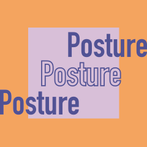
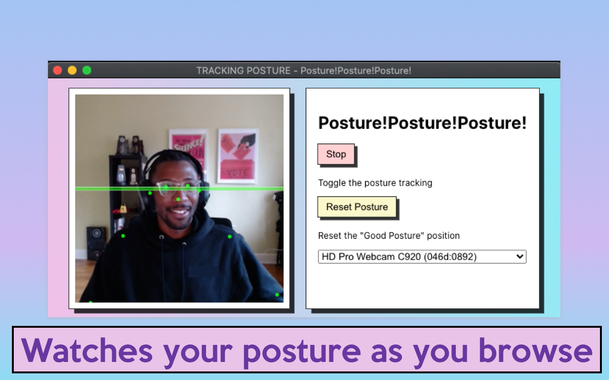
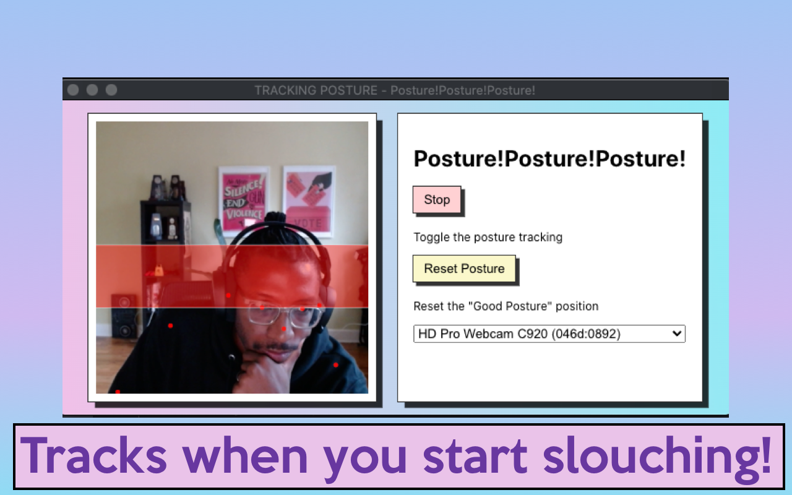

# Posture Chrome Extension 

This is a Chrome Extension to help you keep track of your posture while surfing the web

https://user-images.githubusercontent.com/6319238/141663339-4b05139f-adbf-4626-9de2-0160073671bb.mp4

# How It Works

## Install from the Chrome Webstore (coming soon) 
- COMING SOON

## Installing and Running In Developer Mode

### Procedures:

1. Check if your [Node.js](https://nodejs.org/) version is >= **14**.
2. Clone this repository.
3. Run `npm install` to install the dependencies.
4. Run `npm start`
5. Load the extension on Chrome following:
   1. Access `chrome://extensions/`
   2. Check `Developer mode`
   3. Click on `Load unpacked extension`
   4. Select the `build` folder.
8. Launch the Extension.
   1. Open the `Options Popup` by clicking the button in the browser action menu
   2. Start the camera
      - You'll need to allow camera access on first use
   3. Wait for the Model Tracking to kick in (you'll need to make the Options window visible / active at least once for the tracking to work correctly )
   4. surf the web with good posture!
      - you can reset the "Good Posture" position with the browser action menu

## Technologies Included
- [Tensorflow.js - MoveNet](https://www.tensorflow.org/hub/tutorials/movenet)
- [React 17](https://reactjs.org)
- [Webpack 5](https://webpack.js.org/)
- [Webpack Dev Server 4](https://webpack.js.org/configuration/dev-server/)
- [React Hot Loader](https://github.com/gaearon/react-hot-loader)
- [eslint-config-react-app](https://www.npmjs.com/package/eslint-config-react-app)
- [Prettier](https://prettier.io/)
- [TypeScript](https://www.typescriptlang.org/)

## TODO 
- [] User adjustable posture deviation range
- [] Indicate status of "Watching" or "Not Watching" in Browser Action Icon
